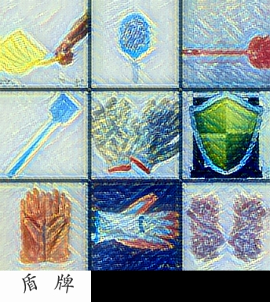
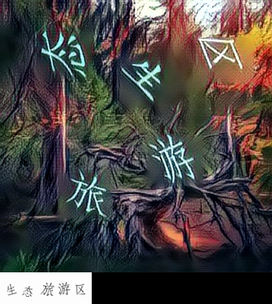

# verification_code

  

所有图片识别项目，数据抓取项目都可合作。

## 项目解决了哪些问题？

	
	
	
	
	
	

## 待更新内容

如果对您有用，请给个star:star::star::star:谢谢。点赞可让我看到大家的关注情况，持续更新的动力，谢谢支持。

许多内容待整理。

:star: **~~更新极验打码测试接口~~**:star:：

~~垃圾服务器，图片识别速度很慢，随便用用，随时会挂掉，有疑问请留言~~

~~可用于学习性质的数据标注和测试，严禁用于商业项目，谢谢配合~~

~~(接口已关闭，谢谢关注)~~

### 极验的JS破解流程以及点选验证码识别模型

极验分为三个部分，1. 破解了前端，获取validate参数；2. 文字类的验证码；3. 滑动验证码。验证码部分结合机器学习在本地打码。

- [极验验证码前端JS破解思路](./doc/jiyan_gt_challenge.md)

	极验js方面，获取validate就完结了。

  - [x] gt、challenge
  - [ ] validate
  - [x] [获取gt、challenge、validate，代码DEMO](./doc/jiyan_gt_challenge_demo.ipynb)
  
- 点选验证码汉字识别模型

  这部分极验和易盾是通用的，数据集改改就好了。如果有数据集可以和我共享，我收集完统一标注然后共享出来。数据集完备后更新一波`一步识别`的模型出来。

  - [x] [Ubuntu环境安装](./doc/Ubuntu18.04%20install%20darknet%20yolo-v3%7Ccuda%7Ccudnn%7Copencv%7Canaconda.md)
  	- NVIDIA-SMI|CUDA|cuDNN|OpenCV|Anacoda
  - [x] [汉字定位（目标检测）](./hanzi_detection/README.md)
  - [x] [汉字识别](./hanzi_detection/readme_classify.md)
  - [x] [定位模型训练手册（含数据）](./doc/detector_train_handbook.md)
  - [x] [识别模型训练手册（含数据）](./doc/classifier_train_handbook.md)
  - [x] [Python中使用模型](./doc/在Python中使用模型.ipynb)
  - [ ] 模型速度优化
  
- 九宫格类型验证码

  - [x] [数据准备](./doc/九宫格图片验证码训练集.md)
  - [ ] 分类模型训练手册

- 滑动3.0和机器学习

  - [ ] 滑动轨迹

### 瑞数JS

