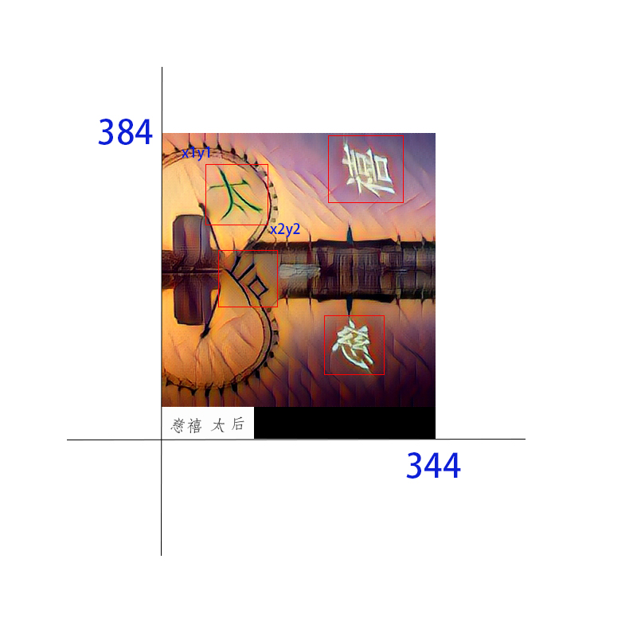

# 定位模型训练手册

此次更新了汉字目标检测的训练内容，从基础的环境编译开始。顺便说一下，GPU的环境是必要的，CPU训练极慢...

关于最终模型识别效率：我生产环境是0.08S一张图，模型文件200多M，用的垃圾显卡。如果没有显卡，可以进行模型优化，如果有反应这个问题的童鞋，后续更新优化。

[环境的安装和准备看这里](./Ubuntu18.04%20install%20darknet%20yolo-v3%7Ccuda%7Ccudnn%7Copencv%7Canaconda.md)

## 一、数据准备

数据包括了训练数据集和验证集。训练集我放了1K份在`files/train`目录下；验证集放了500份在`files/valid`目录下。

### 1.1 训练数据集的准备

介绍一下数据集的格式。目录`files/train/jiyan_train_imgs_txt_1K`下的文件形式如下：

```shell
aba5bec4daa6c11fdd684594778e7737.jpg
aba5bec4daa6c11fdd684594778e7737.txt
5679c2443905cec1f43c9b2b69fd9efd.jpg 
5679c2443905cec1f43c9b2b69fd9efd.txt 
...
...
```

我们本次的检测目标只有一个是汉字`hanzi`（classes=1），简单来说目标就是输出一个图片中所有汉字的坐标。达到这种效果：


在构建训练集的时候，我们要同时准备`图片`和`坐标`两个文件。

一个`jpg`图片，对应一个同名的`txt`文件，图片文件没什么好说的，就是待检测的图片。

`txt`文件内容如下：

```txt
0 0.6918604651162791 0.6875 0.20348837209302326 0.15625
0 0.7441860465116279 0.1171875 0.20348837209302326 0.15625
0 0.2616279069767442 0.203125 0.20348837209302326 0.15625
0 0.3226744186046512 0.4895833333333333 0.20348837209302326 0.15625
```

这里的四行内容，对应图片上的四个汉字的`classes`和`position`信息，因为我们就只有一个（标签）`classes`是`hanzi`，所以所有的值都是`0`。如果我们有两个目标需要检测，比如`中文`和`英文`，classes=2，`txt`文件的每一行的第一列就可能是：`0`或者`1`，多个目标，以此类推。

这个`txt`文件的构造需要说明一下，第一列上面已经说了；后面四列代表着汉字的`x,y,width,height`，而且是经过处理的值，这里介绍一下处理过程：

我们在标记训练数据的时候，给每个汉字的位置信息都标注出来，如下：



以`太`字为例，坐标为：`x1y1,x2y2`，整个图片大小为：`width:344，height:384`

```python
Python 3.7.4 (default, Aug 13 2019, 15:17:50) 
[Clang 4.0.1 (tags/RELEASE_401/final)] :: Anaconda, Inc. on darwin
Type "help", "copyright", "credits" or "license" for more information.
>>> def convert(size, box):
...     dw = 1. / (size[0])
...     dh = 1. / (size[1])
...     x = (box[0] + box[1]) / 2.0 - 1
...     y = (box[2] + box[3]) / 2.0 - 1
...     w = box[1] - box[0]
...     h = box[3] - box[2]
...     x = x * dw
...     w = w * dw
...     y = y * dh
...     h = h * dh
...     return (x, y, w, h)
... 

>>> convert((344,384),(22,82,195,265))
(0.14825581395348836, 0.5963541666666666, 0.1744186046511628, 0.18229166666666666)
```

这里的`convert`参数为：`convert((width, height), (x1, x2, y1, y2))`，输出的结果即为`txt`文件后四列的内容。

最重要的数据集准备完了，然后再配置一下模型数量参数即可开始训练，有如下几个文件：

- data文件：data/detector.data，例子：

  ```data
  classes = 1											# 检测目标数量
  train = train/train.txt					# 训练文件路径
  valid = valid/valid.txt					# 验证文件路径
  names = data/jiyan.names				# names文件路径
  backup = backup/								# 训练完的模型保存路径
  ```

  - `train.txt`文件的生成，这个文件内容是`训练数据集`中每个`jpg`文件的`绝对路径`，只要`jpg`文件的路径即可，模型会找对应路径下的`txt`文件。

    ```txt
    /home/files/jiyan_train_imgs_txt_1K/c5ff5214ef37bcf7db239b02a94a34da.jpg
    /home/files/jiyan_train_imgs_txt_1K/d088c915a03c77bc89a9e466074f10a8.jpg
    /home/files/jiyan_train_imgs_txt_1K/814613e0ac5d67cd9f9fdce55c8ec0d4.jpg
    ...
    ...
    ```

    可以在Linux中直接生成：

    `find path_to_train_dir -name '*.jpg' > path/train.txt`

  - `valid.txt`文件生成同上

- names文件，内容如下：要检测的目标名称

  ```txt
  hanzi
  ```

- 权重文件

  在训练的时候可以基于官方的`卷积权重`来开始，下载到项目的`backup`目录下即可。

  文件太大，请自行下载。

  [下载地址](https://pjreddie.com/media/files/darknet53.conv.74)
  
- 配置文件：`cfg/detecter.cfg`

  其中`max_batches = 1500`是训练的轮数，可以根据需要修改。


## 训练模型

当我们所有数据文件都准备好后，就可以编译项目，开始训练了。

1. 首先进入项目文件夹：`cd hanzi_detection`

2. 修改`Makefile`文件：`vim Makefile`

   如果不用gpu训练，这步跳过。

```shell
GPU=1			# 使用GPU
...
...
NVCC=/usr/local/cuda-10.1/bin/nvcc 			# nvcc路径改为cuda的安装目录下的nvcc
```

3. 编译项目：`make clean` `make`

4. 训练：

   `./darknet detector train data/detector.data cfg/detector.cfg backup/darknet53.conv.74`

   训练完会在`backup`目录下生成`xxx_final.weights`文件

5. 验证集

   `./darknet detector valid cfg/detector.data cfg/detector.cfg backup/xxx_final.weights`

   在`results`目录下生成结果

6. 单张检测

   `./darknet detector test cfg/detector.data cfg/detector.cfg backup/xxx_final.weights`

   然后输入要检测的图片地址，即可在根目录下生成`predictions.jpg`

   


**如果您看到了这里，请给个star，谢谢，如有错误遗漏，请留言指正，感激**


